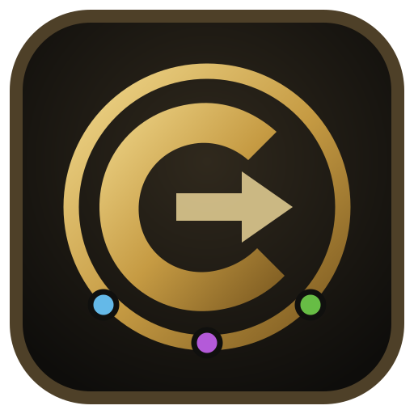
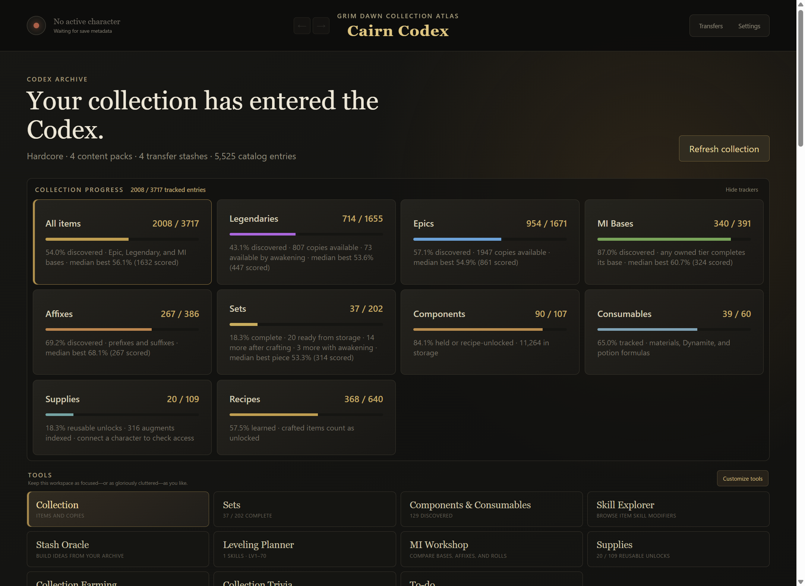
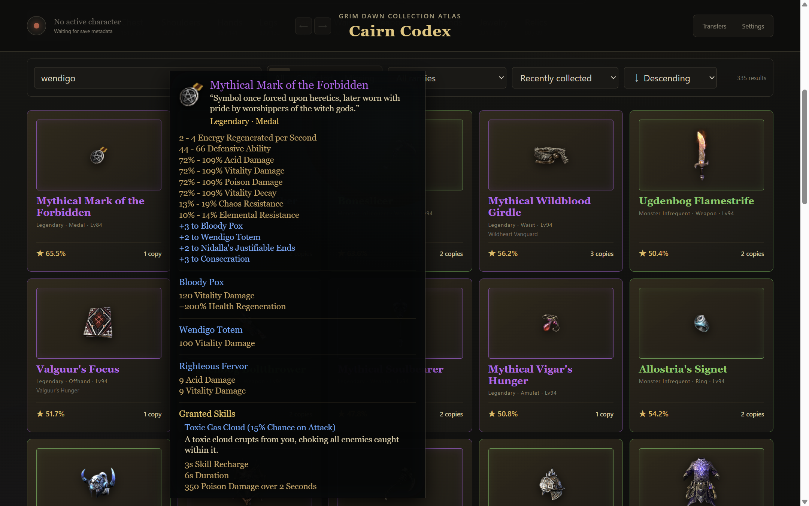
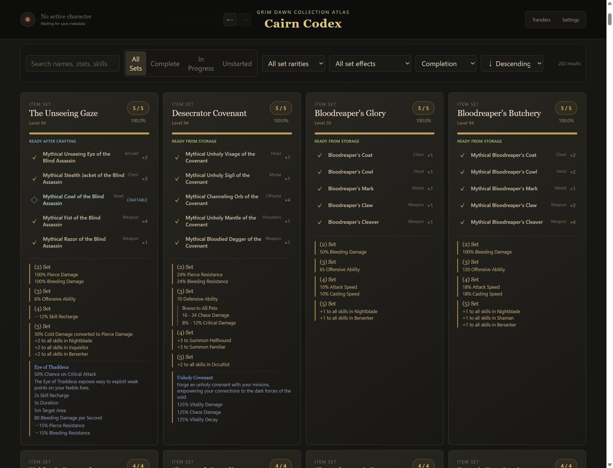
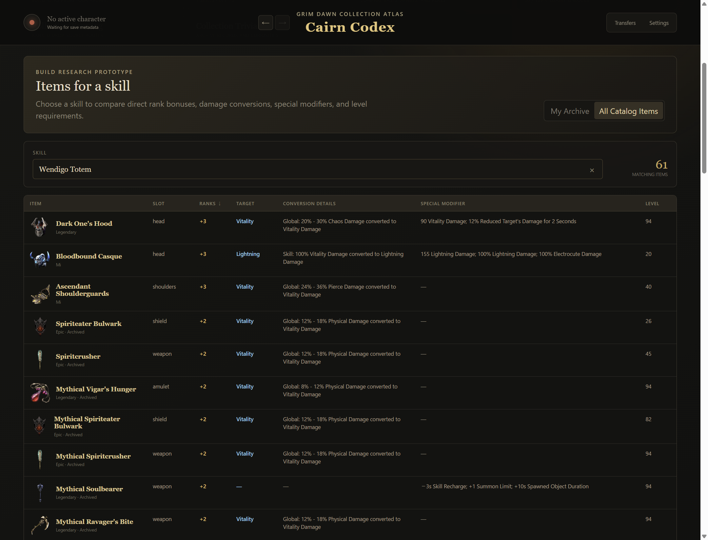

<p align="center">
  
</p>

<h1 align="center">Cairn Codex</h1>

<p align="center">
  A local-first collection atlas, item archive, and build-planning companion for
  <strong>Grim Dawn</strong>.
</p>

<p align="center">
  
  
  
  
  
</p>

> [!WARNING]
> Cairn Codex is pre-release software. It is an unofficial community project
> and is not affiliated with or endorsed by Crate Entertainment. Live transfers
> are experimental and deliberately fail closed on unknown game builds.



## What is Cairn Codex?

Cairn Codex answers two questions that a physical stash is bad at answering:

1. **What have I found?** Track Epics, Legendaries, sets, Monster Infrequents,
   affixes, recipes, components, consumables, and reusable faction supplies.
2. **What can I build with it?** Search every item stat and skill modifier,
   compare exact copies, explore skill support, and turn a character into a
   level-ordered shopping list.

The archive is designed around collection semantics rather than infinite-stash
semantics. Every real copy keeps its seed, affixes, rolls, pin state, and transfer
history, while the browser presents a clean canonical entry for each base item.

### Highlights

- **Pokédex-style completion:** collection totals by rarity, slot, set, MI base,
  affix, recipe, component, consumable, and reusable supply.
- **Game-native presentation:** locally extracted item art, rarity colors,
  roll ranges, granted skills, set bonuses, acquisition sources, and scrollable
  Grim Dawn-style tooltips.
- **Full-text and structured search:** names, flavor text, stats, skills, sets,
  item types, content packs, and level expressions such as `level:>=75`.
- **Exact copy comparison:** seed-applied values, affixes, pet bonuses,
  percentile breakdowns, automatic best-copy selection, and user-pinned picks.
- **Build research:** Skill Explorer, Leveling Planner, MI Workshop, Stash
  Oracle, collection-farming recommendations, and collection trivia.
- **Account knowledge:** learned recipes, craftable set pieces, components,
  writs, mandates, merits, warrants, augments, and movement runes.
- **Item Assistant migration:** verified, repeatable import of Softcore and
  Hardcore copies plus retained incoming queue items.
- **Local-first:** no account, cloud service, telemetry, or bundled game data.

<table>
  <tr>
    <td width="50%">
      
      <br><strong>Game-native item details</strong> — exact ranges, skill modifiers,
      pet bonuses, acquisition sources, and roll quality.
    </td>
    <td width="50%">
      
      <br><strong>Set collection</strong> — completion, level, crafting, awakening,
      owned pieces, and every threshold bonus.
    </td>
  </tr>
  <tr>
    <td colspan="2">
      
      <br><strong>Skill Explorer</strong> — ranks, conversions, special modifiers,
      item level, ownership, and acquisition details.
    </td>
  </tr>
</table>

## Safety model

Cairn treats save mutation as a transaction, not a file-copy shortcut.

- Browsing and indexing are read-only by default.
- Every closed-game stash write is backed up, source-hash checked, written beside
  the target, flushed, reparsed, verified, and replaced atomically.
- Live mode never rewrites the stash file while Grim Dawn is open. A separate,
  opt-in, fingerprint-allowlisted adapter delivers and ingests items in game
  memory using durable queue receipts.
- Multi-item operations are individually acknowledged. Unacknowledged copies
  remain stored if the destination fills or an outcome becomes uncertain.
- An operation journal, automatic backups, receipts, and quarantine records make
  interrupted work recoverable and auditable.

Read the [write transaction design](docs/architecture/write-transactions.md),
[live adapter design](docs/architecture/live-game-adapter.md), and
[recovery guide](docs/recovery.md) before modifying transfer code.

## Installing a release build

Cairn Codex currently targets 64-bit Windows.

1. Download the per-user Setup executable or portable Windows x64 ZIP from the
   release, together with its `.sha256` file.
2. Verify the artifact:

   ```powershell
   Get-FileHash .\Cairn-Codex-*.exe -Algorithm SHA256
   # or
   Get-FileHash .\Cairn-Codex-*.zip -Algorithm SHA256
   ```

3. Run Setup, or extract the complete portable folder and launch
   `Cairn Codex.exe`. Do not run it inside the ZIP or separate the executable
   from its `resources` directory.

The unsigned beta may trigger Windows SmartScreen. A release build is
self-contained and requires neither Node.js nor a separately installed .NET
runtime. Initial startup can take a few minutes while Cairn indexes the installed
game data.

Collection browsing works without live mode. Consult the maintained
[compatibility matrix](docs/compatibility.md) before enabling transfers.

### Migrating from Grim Dawn Item Assistant

Open **Settings → Import from Item Assistant** and select Item Assistant's
`userdata.db`. Cairn creates and hash-verifies an immutable backup before reading
the source, imports SC and HC copies plus retained incoming queue receipts, and
skips copies already present in the archive. The import is safe to repeat and
never modifies or deletes Item Assistant data.

Close Item Assistant during migration so its database cannot change while the
verified backup is being created.

## Building from source

### Prerequisites

- Windows 10 or 11, x64
- [Git for Windows](https://git-scm.com/download/win)
- [Node.js 22 or newer](https://nodejs.org/)
- [.NET SDK 10](https://dotnet.microsoft.com/download)
- A local Grim Dawn installation for installed-game scans and desktop smoke tests

The ordinary TypeScript build and CI safety tests do not require personal save
data. Cairn never expects game archives or saves to be committed to the repo.

### Install dependencies and verify

From a PowerShell prompt in the cloned repository:

```powershell
npm.cmd ci
npm.cmd run verify
```

`verify` performs the repository/provenance audit, production TypeScript/Vue
build, .NET helper build, atomic-write self-test, native live-queue serializer
self-test, and isolated discovery tests.

Run the deeper installed-game desktop smoke suite with:

```powershell
npm.cmd run smoke:desktop
```

It reads the installed game and discovered stashes but uses an in-memory Codex
database and disposable transaction fixtures. It does not perform a live transfer.

### Development mode

```powershell
npm.cmd run dev
```

The renderer uses Vue 3 and TypeScript through Electron Vite. The helper can be
built independently:

```powershell
dotnet build .\src\helper\CairnCodex.GrimDawn\CairnCodex.GrimDawn.csproj
```

### Build a portable Windows application

```powershell
npm.cmd run package:win
```

Launch:

```text
dist\package\Cairn Codex-win32-x64\Cairn Codex.exe
```

The package contains Electron and a self-contained .NET helper. Keep the entire
generated directory together.

### Build release artifacts

From a clean worktree:

```powershell
npm.cmd run package:release
```

This produces the unsigned installer, portable ZIP, SHA-256 file, and manifest
under `dist\release`. The release harness audits package contents and native
fingerprints before emitting artifacts. See the [release readiness checklist](docs/release-readiness.md)
and [test matrix](docs/test-matrix.md) for the remaining manual live gates.

## Architecture

```text
Vue 3 + TypeScript renderer
            │
      typed Electron IPC
            │
Electron main process ─── SQLite archive
            │
    newline-JSON over stdio
            │
small .NET parser / serializer helper
            │
Grim Dawn ARZ, ARC, saves, and transfer stashes
```

The renderer has no direct filesystem or database access. Electron owns the
application lifecycle, SQLite persistence, caches, watching, and operation
orchestration. The helper owns the Grim Dawn binary-format boundary.

Useful design references:

- [Collection schema and discovery semantics](docs/architecture/collection-schema.md)
- [Helper protocol](docs/architecture/helper-protocol.md)
- [Character import](docs/architecture/character-import.md)
- [Formula and recipe import](docs/architecture/formula-import.md)
- [Live adapter compatibility history](docs/live-hook-compatibility.md)

## Local data and privacy

Cairn stores its archive, settings, caches, operation journal, receipts,
quarantine, and backups under `%APPDATA%\cairn-codex`. Settings can open that
directory and export a diagnostic report that omits item payloads and save data.

Do not attach character saves, stash files, the archive database, crash dumps,
or raw live-queue files to a public issue. Follow the [recovery guide](docs/recovery.md)
when a transfer outcome is uncertain.

## Support scope

- English item data
- Vanilla Grim Dawn and locally installed official expansions
- Local Windows saves and discovered Steam/GOG installations
- Epic, Legendary, Monster Infrequent, and named green skill-support bases
- Prefix/suffix discovery and MI copy comparison
- Reusable faction supplies and finite stackable consumables

Unknown game and native-adapter fingerprints remain read-only until explicitly
verified. Code signing and automatic updates are intentionally deferred for the
first private beta.

## Contributing

Bug reports, focused UX feedback, parser fixtures, and carefully scoped pull
requests are welcome. Read [CONTRIBUTING.md](CONTRIBUTING.md) before submitting
changes—save-data safety and repository privacy checks are mandatory.

## Attribution and license

The minimum transfer-stash, game-database, and native-adapter layer is derived
from the MIT-licensed [Grim Dawn Item Assistant](https://github.com/marius00/iagd).
The pinned upstream inventory and local modifications are documented in
[docs/upstream/gdia.md](docs/upstream/gdia.md), `native/patches`, source headers,
and [THIRD_PARTY_NOTICES.md](THIRD_PARTY_NOTICES.md).

Cairn Codex is distributed under the [MIT License](LICENSE). Grim Dawn names,
item data, and artwork belong to their respective owners; the application reads
them from the user's installed game and does not distribute the game database.
